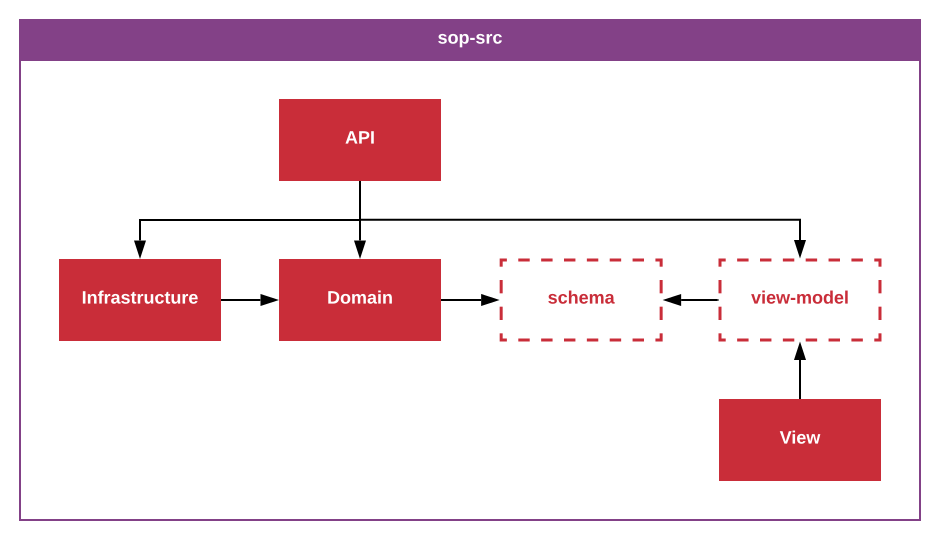

_**sop-src**-1.0.0_
_**Author:** Erik Landvall_
# Standard Operating Procedure
#### Source code
---

This standard addresses direction of dependencies between different layers of the source code. This standard is strict and must be followed with no exceptions.

This standard is expected to be applied on the source code that defines the logic of a service.

As the diagram reveals; the `API` layer, knows of and can have dependencies from, the `Infrastructure`, `Domain` and the `View` layer, as well as from the `API` layer it self. The `API` is expected to only know of the `view-model` in the `View` layer.

The `Infrastructure` layer only knows of the `Domain` layer, and can therefor only have dependencies from the `Domain` layer or other parts of the `Infrastructure` layer.

The `Domain` layer knows of it self and nothing outside its own context. Implementations in the `Domain` layer can only depend on definitions that persists within its layer. The sub-layer `schema` is explicitly expressed for this standard to be able to define the restricted access of the `view-model` sub-layer into the `Domain` layer.

The `View` possess a sub-layer called `view-model`, expressed specifically in the diagram to express the restricted knowledge the `API` layers has of the `View` layer. The `View` layer does not have knowledge to anything outside its layer, by design. The idea is for the `View` layer to be as dumb as possible; meaning, less logic in the view is encourage.

This standard implies that the API has a responsibility to eager load all data the view requires.

---

Often we notice that implementations in one layer require a knowledge of a layer it has no access to, in accordance with this standard. A concrete example is the common problem with a domain instance that require knowledge of infrastructure logic. To solve a dependency from the domain to the infrastructure, the dependency inversion principle, part of the SOLID principles authored by Robert C. Martin, can be applied. An interface must be defined in the domain layer that instances in the infrastructure implements, and that other actors in the domain can depend on.
